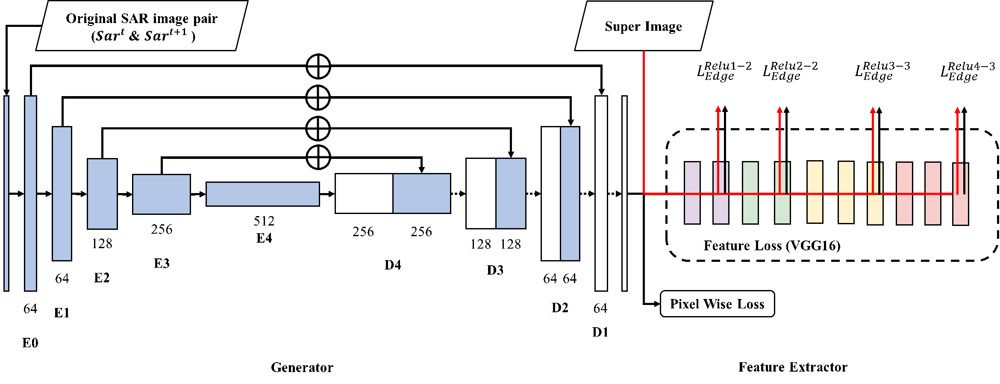

# A CNN-based self-supervised synthetic aperture radar image denoising approach 
## Introduction
Synthetic aperture radar (SAR) plays an essential role in earth observation and projection due to its capability to penetrate clouds, which makes it possible to monitor terrestrial surface under all weather conditions. Multiplicative noise often occurs in the SAR signal, hampering the retrieval of information from SAR imagery. Convolutional neural networks (CNNs) have been used in many computer vision tasks and are helpful in image denoising. However, current CNN-based denoising approaches inevitably leads to a "washed out" effect that loses spatial details. Another limitation is that most typical CNN-based denoising models require a noise-free image for training. To address these issues, we propose a novel end-to-end self-supervised SAR denoising model: Enhanced Noise2Noise (EN2N), which can be trained without a noise-free image. To enhance the quality of the denoised images, the perceptual features from a pre-learned CNN are introduced to restore the spatial details by a hybrid loss function. 

In this repository we will release the source code from the paper once paper has been published.

